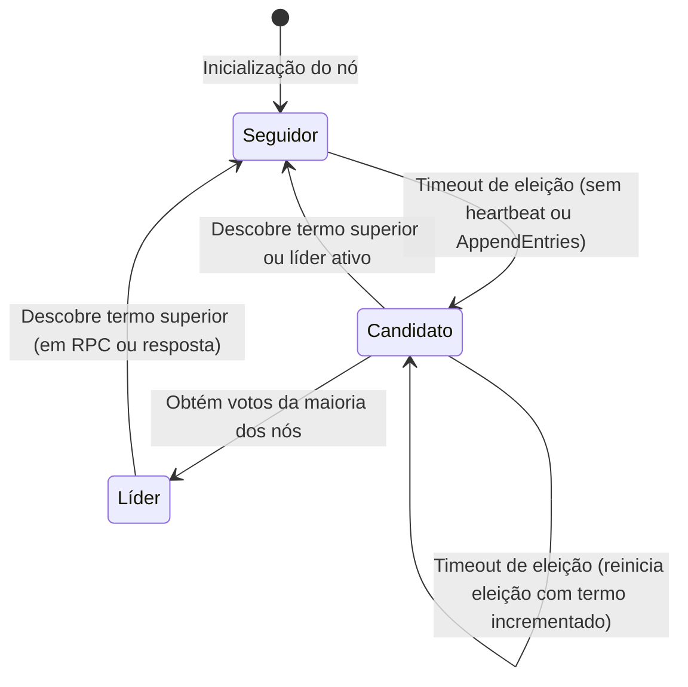

# Relatório Técnico: Implementação do Protocolo Raft em Rust com Target WASM

**Repositório do Projeto:** [github.com/eduardorittner/rafty](https://github.com/eduardorittner/rafty)

## 1. Introdução do Problema

No contexto de sistemas distribuídos, o problema do consenso tem como objetivo fazer com que nós independentes concordem sobre uma sequência de valores mesmo na presença de falhas parciais do sistema. Este problema é fundamental para a construção de sistemas tolerantes a falhas, como bancos de dados distribuídos, sistemas de coordenação e blockchains. No entanto, "falhas parciais" é um termo vago, e cada algoritmo de consenso distribuído possui garantias distintas, e protege contra tipos de falhas distintos.

Protocolos Leader-based como Paxos e Raft garantem consistência sequencial e progresso, desde que a maioria dos nós esteja viva. Já os protocolos tolerantes a falhas bizantinas (como PBFT ou FBFT), isto é, são tolerantes a nós "maliciosos" que propositalmente enviam mensagens falsas. Os protocolos tolerantes a falhas bizantinas são substancialmente mais complexos ou computacionalmente caros, ou os dois, visto que num geral oferecem estritamente mais garantias que os protocolos não tolerantes a falhas bizantinas.

O algoritmo **Paxos**, proposto por Leslie Lamport em 1989, estabeleceu-se como o primeiro algoritmo de consenso prático e formalmente verificado. Apesar de sua correção matemática, o Paxos tornou-se notório por sua complexidade de compreensão e implementação. A descrição original do algoritmo utiliza uma abordagem baseada em "propostas" e "aceites" que, embora elegante do ponto de vista teórico, resulta em código difícil de depurar e manter na prática[^1].

Paralelamente ao desenvolvimento do Paxos, **Viewstamped Replication** foi proposto por Oki e Liskov em 1988[^5]. Este algoritmo, desenvolvido independentemente do Paxos, compartilha conceitos fundamentais como a utilização de um nó primário (líder) para coordenar a replicação e a organização do tempo em "vistas" (views), análogas aos termos do Raft. Apesar de sua influência significativa no design de sistemas distribuídos modernos, o Viewstamped Replication recebeu menos atenção inicial na literatura acadêmica.

Outras variações do Paxos, como **Multi-Paxos** (para consenso sobre sequências de valores)[^2] e **Fast Paxos** (para otimização de latência)[^3], herdaram esta complexidade, limitando sua adoção em sistemas práticos. A dificuldade de implementação correta levou muitos engenheiros a desenvolverem soluções ad-hoc, frequentemente incorretas ou incompletas.

Publicado em 2014 por Diego Ongaro e John Ousterhout[^4], o **Raft** foi projetado com um objetivo explícito: ser **compreensível**. Diferentemente do Paxos, que foi desenvolvido primeiramente como um exercício teórico, o Raft foi concebido desde o início como uma base prática para implementação de sistemas reais. As principais inovações do Raft em termos de compreensibilidade incluem:

1. **Decomposição modular**: O algoritmo separa claramente as sub-tarefas de consenso em componentes distintos que podem ser discutidos, implementados e testados separadamente: eleição de líder, replicação do log e segurança.
2. **Fortes garantias de estado**: O Raft impõe restrições mais fortes que o Paxos, limitando o espaço de estados possíveis e simplificando o raciocínio sobre o sistema.
3. **Mudança de configuração segura**: O Raft introduz um mecanismo baseado em consenso para adicionar ou remover nós do cluster de forma segura, sem interromper o serviço.
4. **Simplificação da lógica de consenso**: Dentro do Paxos, a lógica para garantir o consenso passa por várias etapas (Prepare, Promise, Accept e Accepted) que são coordenadas por 3 tipos de nós (proposers, acceptors e learners). Já no protocolo raft, o consenso é mais simples, o líder replica as mensagens para seguidores e considera que uma mensagem está replicada quando no mínimo metade dos nós tiverem confirmado seu processamento.

## 2. O Algoritmo Raft

O Raft é geralmente utilizado para replicar uma sequência de comandos, que podem ser executados independentemente por cada nó para chegar ao mesmo estado final, num modelo chamado de **máquinas de estado replicadas** (replicated state machines)[^6]. O algoritmo garante consistência sequencial (ou seja, uma única ordem global) para os comandos desde que a maioria dos nós esteja operacional, essas falhas podem incluir crashes, perda arbitrária de mensagens, redes falhas, dentre outras.

Em um dado momento, cada nó encontra-se em exatamente em um de três estados: seguidor, candidato e líder. Seguidores são nós passivos que respondem a requisições de líderes e candidatos, e não iniciam requisições por conta própria. Seguidores que não recebem nenhum tipo de comunicação do líder dentro de um determinado período se tornam candidatos e passam a solicitar votos de outros nós para tentar se estabelecer como um novo líder. O líder é o nó responsável por gerenciar toda a replicação do log, em qualquer dado momento existe no máximo um líder válido (isto é, o líder com maior termo). A transição entre estes três estados centrais é ilustrada pelo diagrama a seguir:

O tempo no Raft é dividido em **termos**, que são números inteiros sequenciais que atuam como relógios lógicos. Cada termo começa com uma eleição:

1. Quando um seguidor não recebe mensagens do líder dentro de um **timeout de eleição** (valor aleatório entre limites configurados), ele transita para candidato.

2. O candidato incrementa seu termo, vota em si mesmo e envia requisições de voto (**RequestVote RPC**) para todos os outros nós.

3. Um nó concede seu voto se:
   - O termo do candidato é maior ou igual ao termo atual
   - O candidato possui um log pelo menos tão completo quanto o seu (comparação de último índice e termo)
   - Ainda não votou em outro candidato no termo atual

4. Um candidato torna-se líder ao receber votos da **maioria** dos nós do cluster.

5. No caso de nenhum candidato obter votos da maioria, novas eleições serão iniciadas até que eventualmente um líder seja eleito. Os timeouts de eleições possuem uma faixa possível de valores, e são definidos aleatoriamente por cada nó para minimizar a chance de empates.

Uma vez eleito, o líder é responsável por replicar entradas de log enviadas por clientes para os seguidores através de requisições `AppendEntries` RPC. Cada seguidor valida a consistência do log comparando o índice e termo da entrada anterior, adicionando as entradas novas no log local, consertando quaisquer inconsistências encontradas e enviando uma resposta ao líder. Quando o líder recebe a confirmação da maioria dos nós referente a uma entrada, ela é considera aplicada e o líder notifica os seguidores para aplicá-la a sua máquina de estado.

Para manter sua autoridade, o líder envia periodicamente heartbeats (`AppendEntries` RPCs vazias) para todos os seguidores. Se um seguidor não recebe nenhuma mensagem dentro do timeout de eleição, ele assume que o líder falhou, se torna um candidato e inicia uma eleição.

A formulação matemática do Raft garante as seguintes propriedades críticas:

- **Eleição com log completo**: Um candidato só pode ser eleito se seu log estiver pelo menos tão completo quanto o de qualquer outro nó.

- **Líder sempre possui entradas comitadas**: Devido à restrição de eleição, um líder sempre possui todas as entradas comitadas em seus logs.

- **Casamento de log (Log Matching)**: Se dois logs possuem uma entrada com mesmo índice e termo, então todos os logs até aquele índice são idênticos.

---

## 3. Detalhes da Implementação

A implementação é escrita em Rust[^8] e organizada em três componentes principais:
- **Definição de Mensagens**: Contém a especificação das mensagens do protocolo utilizando Protocol Buffers (protobuf), garantindo serialização eficiente e independente de linguagem.
- **Núcleo do Protocolo**: Contém a lógica de consenso, controle de estado do nó, eleição de líder e replicação do log.
- **Infraestrutura de Simulação**: Contém o simulador para criação de clusters em memória, injeção de falhas de rede e inspeção do estado interno de cada nó.

O núcleo da implementação é estruturado como uma **máquina de estados finita** que processa mensagens de forma determinística. Cada nó do cluster mantém variáveis de estado essenciais para o funcionamento do protocolo, tais como: o termo atual (relógio lógico), em quem o nó votou no termo atual, a identidade do líder conhecido, o papel atual do nó (seguidor, candidato ou líder), o log de comandos local, e o estado dos timeouts para eleições e envio de heartbeats.

O processamento é guiado por duas operações fundamentais:
1. **Passo de Evento (`step`)**: Uma função determinística que recebe uma mensagem (como requisições de voto ou replicação de entradas) e atualiza o estado interno do nó de acordo com as regras do Raft.
2. **Avanço Temporal (`tick`)**: Uma função chamada periodicamente para simular a passagem do tempo. Ela incrementa contadores de tempo e dispara ações como o início de uma campanha eleitoral (se um seguidor sofrer timeout de eleição) ou o envio de heartbeats periódicos (se o nó for o líder).

Esta separação caracteriza o padrão **push/pull**: mensagens de rede são "empurradas" (*push*) para o nó através de eventos, enquanto o controle de tempo e expiração de timeouts é verificado de forma ativa (*pull*).

Para validação e integração, a infraestrutura de simulação provê um simulador de cluster que gerencia múltiplos nós em um único processo. Ele permite pausar e retomar nós individualmente, além de interceptar e manipular as mensagens trocadas, tornando viável a simulação de falhas de rede complexas de forma controlada. Adicionalmente, o sistema é compilado para WebAssembly (WASM)[^9], permitindo que todo o cluster simulado e a lógica de consenso rodem diretamente no navegador para fins de visualização gráfica e demonstrações educacionais.

A comunicação física entre os nós baseia-se em **Protocol Buffers**[^7], que define os dados das entradas de log (`Entry`), as mensagens de controle de termo, commits, respostas e os tipos de mensagens (`AppendEntries`, `RequestVote`, etc.). A lógica do protocolo consome essas estruturas por meio de uma camada de tipos seguros que encapsula as mensagens de rede em representações internas da aplicação. 

Para a execução em rede real, a abstração de canal de comunicação é implementada através de conexões de sockets TCP tradicionais. Cada nó estabelece fluxos de dados com seus pares para o envio e broadcast de mensagens serializadas.

Além dos testes em memória e da visualização em navegador, a arquitetura permite executar cada nó do cluster em um container Docker isolado, simulando um ambiente distribuído real de forma muito próxima de uma implantação de produção. O cenário Docker é configurado com três nós individuais, cada um parametrizado por variáveis de ambiente que definem o identificador do nó, as portas TCP de comunicação, a porta HTTP de diagnóstico e a lista de pares na rede.

Para dar suporte a esse ambiente físico, a arquitetura estende a implementação do canal de comunicação utilizando sockets de rede reais com tratamento de erros e reconexão automática, além de fornecer um servidor HTTP embutido em cada nó. Esse servidor HTTP expõe endpoints para visualizar o status do nó em tempo real, depurar o estado interno em formato estruturado (JSON) e submeter novas propostas de escrita. 

A imagem dos containers é construída em múltiplos estágios para otimização de tamanho, compilando os binários em uma imagem de build e copiando apenas o executável final para uma imagem de execução enxuta. A infraestrutura de containers permite simular partições de rede reais, latência de pacotes (via controle de tráfego do sistema operacional) e queda de servidores.

---

## 4. Estratégia de testes

A validação da correção do protocolo foi realizada por meio de uma estratégia de testes em camadas, unindo testes unitários determinísticos a simulações estocásticas baseadas em sementes pseudoaleatórias. Isso garante que qualquer falha descoberta em cenários dinâmicos complexos possa ser reproduzida e depurada deterministicamente.

Os testes determinísticos focam em cenários específicos do algoritmo, como a eleição do líder na ausência de falhas, a convergência rápida de logs divergentes, a rejeição de votos a candidatos desatualizados e a persistência de invariantes críticas do Raft. 

Já os testes estocásticos (aleatórios) operam gerando sequências de eventos de rede imprevisíveis — como partições de rede arbitrárias, mensagens duplicadas ou perdidas e queda temporária de nós — usando um gerador de números pseudoaleatórios alimentado por uma semente (*seed*). Quando um cenário de teste falha, a semente correspondente é registrada, permitindo rodar novamente o mesmo teste com comportamento idêntico para identificar a causa raiz.

Para viabilizar essa testabilidade sem acoplamento com o ambiente físico de rede e disco, a arquitetura baseia-se em **injeção de dependência** por meio de três abstrações principais:

1. **Abstração de Armazenamento (`Storage`)**: Define a interface para leitura e escrita persistente do log Raft, como a consulta de termos de índices específicos, busca de intervalos de entradas e gravação no log. Durante os testes, utiliza-se uma implementação em memória baseada em um array dinâmico simples. Isso acelera drasticamente a execução dos testes e simplifica a simulação de falhas de escrita e falhas parciais sem a latência e complexidade de I/O de disco físico.
2. **Abstração de Canal (`Channel`)**: Define a interface para envio direto e broadcast de mensagens. Nos testes em memória, essa abstração é implementada através de canais de comunicação na memória do processo, simulando redes instantâneas.
3. **Abstração de Geração de Números Aleatórios (`RngProvider`)**: Abstrai a fonte de entropia do sistema. Para produção, utiliza-se o gerador do sistema operacional; para os testes, utiliza-se um gerador determinístico parametrizado por semente.

Para a injeção controlada de falhas de rede nos testes, o canal de comunicação é envelopado por um componente que simula falhas probabilísticas de entrega. Esse componente utiliza o gerador de números aleatórios para decidir se cada mensagem enviada deve ser transmitida ou descartada silenciosamente de acordo com uma taxa de perda de pacotes configurada. Configurações extremas de taxa de falha (como bloqueio total ou passagem livre) facilitam a simulação imediata de partições de rede.

A tabela a seguir resume como os diferentes tipos de problemas reais são simulados na infraestrutura de testes utilizando essas abstrações:

| Tipo de Falha       | Mecanismo de Simulação                            |
| ------------------- | ------------------------------------------------- |
| Perda de pacotes    | Descarte probabilístico na simulação de canal     |
| Falha de nó         | Pausa e suspensão temporária do nó no simulador   |
| Partição de rede    | Bloqueio bidirecional entre conjuntos de nós      |
| Atraso de mensagens | Bufferização e entrega tardia de mensagens        |
| Falha de líder      | Pausa do líder atual para forçar eleição          |
| Logs inconsistentes | Inicialização direta do array do log com dados divergentes |

---

## 5. Conclusão

A implementação do protocolo Raft apresentada neste relatório demonstra uma abordagem moderna e bem estruturada para consenso distribuído. A separação clara entre o core do protocolo (máquina de estados push/pull) e as camadas de abstração (driver, comunicação, armazenamento) segue princípios de design que favorecem testabilidade e manutenibilidade.

Embora o algoritmo Raft completo especifique mecanismos para mudança dinâmica de configuração (como adição e remoção de nós) e compactação de logs através de snapshots para gerenciar o crescimento do estado físico, essas funcionalidades não foram incluídas na presente implementação. O raciocínio para essa decisão de design reside no fato de que o núcleo implementado — contendo a eleição de líder estável, a replicação básica de entradas e a recuperação de logs consistentes — é suficiente para atingir consistência sequencial na máquina de estados replicada. Em ambientes controlados ou acadêmicos, a configuração estática do cluster e a ausência de snapshots não comprometem a correção das propriedades de segurança e liveness do consenso, mantendo a integridade da ordem de execução de todas as operações por todos os nós.

O uso de abstrações genéricas para o armazenamento, o canal de comunicação e o gerador de números aleatórios permite que a mesma implementação do núcleo do protocolo seja testada em diversos cenários de falha sem modificação do código principal. Esta arquitetura facilita não apenas testes unitários e de integração, mas também a extensão do sistema para diferentes backends de armazenamento e protocolos de comunicação.

A inclusão de suporte a WebAssembly amplia o escopo de aplicação da implementação, permitindo sua utilização em ambientes de navegador para fins educacionais, de visualização ou até mesmo em aplicações distribuídas que operam parcialmente no client-side.

Os testes implementados, combinando abordagens determinísticas e randomizadas, fornecem cobertura abrangente dos comportamentos esperados do protocolo Raft, incluindo cenários adversos de rede e falhas de nós. A capacidade de reproduzir testes falhos através de seeds específicas é particularmente valiosa para depuração de condições de corrida e outros bugs concorrentes.

---

## Referências

[^1]: LAMPORT, L. The Part-Time Parliament. **ACM Transactions on Computer Systems**, v. 16, n. 2, p. 133-169, 1998. DOI: 10.1145/279227.279229.

[^2]: LAMPORT, L. Paxos Made Simple. **ACM SIGACT News**, v. 32, n. 4, p. 18-25, 2001. Disponível em: <https://lamport.azurewebsites.net/pubs/paxos-simple.pdf>.

[^3]: LAMPORT, L. Fast Paxos. **Distributed Computing**, v. 19, n. 2, p. 79-103, 2006. DOI: 10.1007/s00446-006-0005-y.

[^4]: ONGARO, D.; OUSTERHOUT, J. In Search of an Understandable Consensus Algorithm. **USENIX Annual Technical Conference**, 2014. p. 305-319.

[^5]: OKI, B. M.; LISKOV, B. H. Viewstamped Replication: A New Primary Copy Method to Support Highly-Available Distributed Systems. In: **ACM Symposium on Principles of Distributed Computing (PODC)**. Toronto, Canada: ACM, 1988. p. 8-17. DOI: 10.1145/62546.62549.

[^6]: SCHNEIDER, F. B. Implementing Fault-Tolerant Services Using the State Machine Approach: A Tutorial. **ACM Computing Surveys**, v. 22, n. 4, p. 299-319, 1990. DOI: 10.1145/98163.98167.

[^7]: Google Protocol Buffers Documentation. Disponível em: <https://developers.google.com/protocol-buffers>. Acesso em: 2026.

[^8]: The Rust Programming Language Documentation. Disponível em: <https://doc.rust-lang.org/>. Acesso em: 2026.

[^9]: WebAssembly Documentation. Disponível em: <https://webassembly.org/>. Acesso em: 2026.
