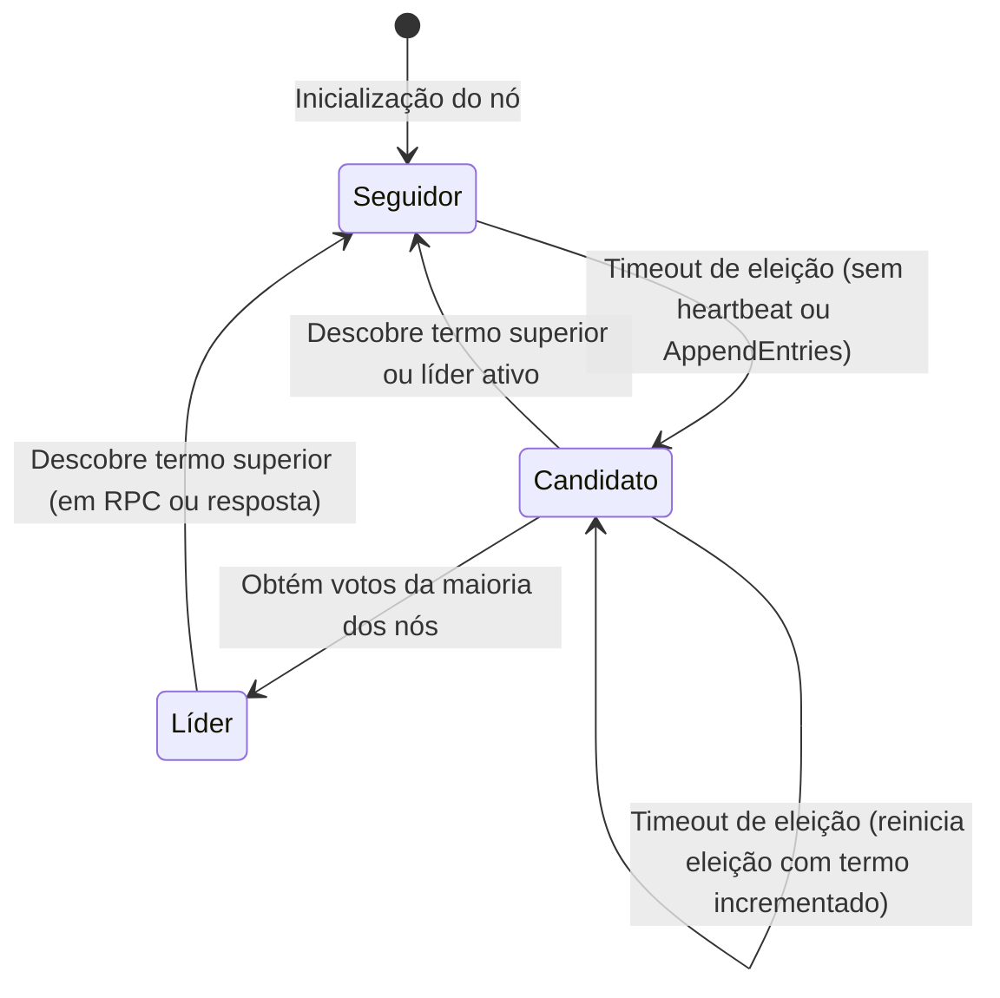

# Relatório Técnico: Implementação do Protocolo Raft em Rust com Target WASM

## 1. Introdução do Problema

No contexto de sistemas distribuídos, o problema do consenso tem como objetivo fazer com que nós independentes concordem sobre uma sequência de valores mesmo na presença de falhas parciais do sistema. Este problema é fundamental para a construção de sistemas tolerantes a falhas, como bancos de dados distribuídos, sistemas de coordenação e blockchains. No entanto, "falhas parciais" é um termo vago, e cada algoritmo de consenso distribuído possui garantias distintas, e protege contra tipos de falhas distintos.

Protocolos Leader-based como Paxos e Raft garantem consistência sequencial e progresso, desde que a maioria dos nós esteja viva. Já os protocolos tolerantes a falhas bizantinas (como PBFT ou FBFT), isto é, são tolerantes a nós "maliciosos" que propositalmente enviam mensagens falsas. Os protocolos tolerantes a falhas bizantinas são substancialmente mais complexos ou computacionalmente caros, ou os dois, visto que num geral oferecem estritamente mais garantias que os protocolos não tolerantes a falhas bizantinas.

O algoritmo **Paxos**, proposto por Leslie Lamport em 1989, estabeleceu-se como o primeiro algoritmo de consenso prático e formalmente verificado. Apesar de sua correção matemática, o Paxos tornou-se notório por sua complexidade de compreensão e implementação. A descrição original do algoritmo utiliza uma abordagem baseada em "propostas" e "aceites" que, embora elegante do ponto de vista teórico, resulta em código difícil de depurar e manter na prática[^1].

Paralelamente ao desenvolvimento do Paxos, **Viewstamped Replication** foi proposto por Oki e Liskov em 1988[^5]. Este algoritmo, desenvolvido independentemente do Paxos, compartilha conceitos fundamentais como a utilização de um nó primário (líder) para coordenar a replicação e a organização do tempo em "vistas" (views), análogas aos termos do Raft. Apesar de sua influência significativa no design de sistemas distribuídos modernos, o Viewstamped Replication recebeu menos atenção inicial na literatura acadêmica.

Outras variações do Paxos, como **Multi-Paxos** (para consenso sobre sequências de valores)[^2] e **Fast Paxos** (para otimização de latência)[^3], herdaram esta complexidade, limitando sua adoção em sistemas práticos. A dificuldade de implementação correta levou muitos engenheiros a desenvolverem soluções ad-hoc, frequentemente incorretas ou incompletas.

Publicado em 2014 por Diego Ongaro e John Ousterhout, o **Raft** foi projetado com um objetivo explícito: ser **compreensível**. Diferentemente do Paxos, que foi desenvolvido primeiramente como um exercício teórico, o Raft foi concebido desde o início como uma base prática para implementação de sistemas reais. As principais inovações do Raft em termos de compreensibilidade incluem:

1. **Decomposição modular**: O algoritmo separa claramente as sub-tarefas de consenso em componentes distintos que podem ser discutidos, implementados e testados separadamente: eleição de líder, replicação do log e segurança.
2. **Fortes garantias de estado**: O Raft impõe restrições mais fortes que o Paxos, limitando o espaço de estados possíveis e simplificando o raciocínio sobre o sistema.
3. **Mudança de configuração segura**: O Raft introduz um mecanismo baseado em consenso para adicionar ou remover nós do cluster de forma segura, sem interromper o serviço.
4. **Simplificação da lógica de consenso**: Dentro do Paxos, a lógica para garantir o consenso passa por várias etapas (Prepare, Promise, Accept e Accepted) que são coordenadas por 3 tipos de nós (proposers, acceptors e learners). Já no protocolo raft, o consenso é mais simples, o líder replica as mensagens para seguidores e considera que uma mensagem está replicada quando no mínimo metade dos nós tiverem confirmado seu processamento.

## 2. O Algoritmo Raft

O Raft é geralmente utilizado para replicar uma sequência de comandos, que podem ser executados independentemente por cada nó para chegar ao mesmo estado final, num modelo chamado de **máquinas de estado replicadas** (replicated state machines)[^6]. O algoritmo garante consistência sequencial (ou seja, uma única ordem global) para os comandos desde que a maioria dos nós esteja operacional, essas falhas podem incluir crashes, perda arbitrária de mensagens, redes falhas, dentre outras.

Em um dado momento, cada nó encontra-se em exatamente em um de três estados: seguidor, candidato e líder. Seguidores são nós passivos que respondem a requisições de líderes e candidatos, e não iniciam requisições por conta própria. Seguidores que não recebem nenhum tipo de comunicação do líder dentro de um determinado período se tornam candidatos e passam a solicitar votos de outros nós para tentar se estabelecer como um novo líder. O líder é o nó responsável por gerenciar toda a replicação do log, em qualquer dado momento existe no máximo um líder válido (isto é, o líder com maior termo). A transição entre estes três estados centrais é ilustrada pelo diagrama a seguir:



O tempo no Raft é dividido em **termos**, que são números inteiros sequenciais que atuam como relógios lógicos. Cada termo começa com uma eleição:

1. Quando um seguidor não recebe mensagens do líder dentro de um **timeout de eleição** (valor aleatório entre limites configurados), ele transita para candidato.

2. O candidato incrementa seu termo, vota em si mesmo e envia requisições de voto (**RequestVote RPC**) para todos os outros nós.

3. Um nó concede seu voto se:
   - O termo do candidato é maior ou igual ao termo atual
   - O candidato possui um log pelo menos tão completo quanto o seu (comparação de último índice e termo)
   - Ainda não votou em outro candidato no termo atual

4. Um candidato torna-se líder ao receber votos da **maioria** dos nós do cluster.

5. No caso de nenhum candidato obter votos da maioria, novas eleições serão iniciadas até que eventualmente um líder seja eleito. Os timeouts de eleições possuem uma faixa possível de valores, e são definidos aleatoriamente por cada nó para minimizar a chance de empates.

Uma vez eleito, o líder é responsável por replicar entradas de log enviadas por clientes para os seguidores através de requisições `AppendEntries` RPC. Cada seguidor valida a consistência do log comparando o índice e termo da entrada anterior, adicionando as entradas novas no log local, consertando quaisquer inconsistências encontradas e enviando uma resposta ao líder. Quando o líder recebe a confirmação da maioria dos nós referente a uma entrada, ela é considera aplicada e o líder notifica os seguidores para aplicá-la a sua máquina de estado.

Para manter sua autoridade, o líder envia periodicamente heartbeats (`AppendEntries` RPCs vazias) para todos os seguidores. Se um seguidor não recebe nenhuma mensagem dentro do timeout de eleição, ele assume que o líder falhou, se torna um candidato e inicia uma eleição.

A formulação matemática do Raft garante as seguintes propriedades críticas:

- **Eleição com log completo**: Um candidato só pode ser eleito se seu log estiver pelo menos tão completo quanto o de qualquer outro nó.

- **Líder sempre possui entradas comitadas**: Devido à restrição de eleição, um líder sempre possui todas as entradas comitadas em seus logs.

- **Casamento de log (Log Matching)**: Se dois logs possuem uma entrada com mesmo índice e termo, então todos os logs até aquele índice são idênticos.

---

## 3. Detalhes da Implementação

A implementação foi feita utilizando a linguagem de programação Rust e está separada em 3 bibliotecas (também conhecidas como crates dentro do ecossistema Rust) pequenas e com um único foco cada:

- `proto`: Contém as definições das mensagens do protocolo em protobuf
- `raft`: Contém a implementação do protocolo em si
- `harness`: Contém a infraestrutura necessária para criar clusters de teste, injetar falhas arbitrárias na rede e inspecionar o estado interno de cada nó.

O núcleo da implementação é estruturado como uma **máquina de estados finita** que processa mensagens de forma determinística. A estrutura central é a estrutura de dados `Node<Store, Chan, Rng>`, parametrizada por três tipos genéricos para armazenamento, comunicação com outros nós e geração de valores aleatórios que permitem injeção de dependências e falhas para teste:

```rust
pub struct Node<Store: Storage, Chan: Channel, Rng: RngProvider> {
    pub id: ValidNodeId,
    pub term: u64,
    pub voted_for: NodeId,
    pub leader_id: NodeId,
    pub role: Role,
    pub config: InitialConfig,
    pub storage: RaftLog<Store>,
    pub channel: Chan,
    pub rng: Rng,
    pub election_timeout: u64,
}
```

O método `step()` implementa a lógica de transição de estados baseada em mensagens recebidas:

```rust
pub fn step(&mut self, msg: Message) -> Result<()> {
    match msg {
        Message::StartCampaign => self.start_campaign(),
        Message::Heartbeat(m) => self.step_heartbeat(m),
        Message::HeartbeatResponse(m) => self.step_heartbeat_response(m),
        Message::Append(m) => self.step_append(m)?,
        Message::AppendResponse(m) => self.step_append_response(m)?,
        Message::RequestVote(m) => self.step_vote_request(m),
        Message::RequestVoteResponse(m) => self.step_vote_response(m),
    }
    Ok(())
}
```

Cada variante de mensagem dispara um manipulador específico que atualiza o estado interno do nó conforme as regras do protocolo Raft.

O método `tick()` simula a passagem do tempo, incrementando contadores internos e disparando ações baseadas em timeout, e deve ser chamado periodicamente pela aplicação:

```rust
pub fn tick(&mut self) {
    match &mut self.role {
        Role::Follower(state) => {
            state.ticks_since_last_msg += 1;
            if state.election_timeout_passed(self.election_timeout) {
                // Se torna um candidato e inicia uma eleição
                let _ = self.step(Message::StartCampaign);
            }
        }
        Role::Candidate(state) => {
            state.ticks_since_election_start += 1;
            if state.votes.has_majority_for() {
                // Transição para líder
                // ...
            }
        }
        Role::Leader(state) => {
            state.ticks_since_last_heartbeat += 1;
            if state.ticks_since_last_heartbeat >= self.config.ticks_between_heartbeats {
                self.broadcast_heartbeats();
            }
        }
    }
}
```

Esta separação entre processamento de eventos (`step`) e avanço temporal (`tick`) caracteriza o padrão **push/pull**: mensagens são "empurradas" para o nó via `step()`, enquanto o nó "puxa" informações temporais via `tick()`.

O módulo `harness` fornece uma camada de abstração que envolve o core Raft com interfaces mais acessíveis para testes e integração. A struct `Cluster<Rng>` gerencia múltiplos nós Raft em um único processo, facilitando testes de integração:

```rust
pub struct Cluster<Rng: RngProvider = raft::DefaultRng> {
    pub nodes: Vec<TestNode<Rng>>,
    pub paused_nodes: HashSet<u64>,
    pub message_buffer: Vec<ClusterMessage>,
    state_callbacks: Vec<Box<dyn FnMut(&ClusterEvent)>>,
    pub tick_rate_ms: u64,
    pub rng: Rng,
}
```

Operações como `tick()`, `step()`, `pause_node()` e `resume_node()` permitem simular cenários complexos de falha de forma controlada. O projeto inclui também configuração específica para compilação WASM através do script `wasm.sh`:

```bash
cd harness && wasm-pack build --release --target web --out-dir pkg --out-name rafty_wasm
```

Módulos condicionais (`#[cfg(target_arch = "wasm32")]`) fornecem implementações específicas para ambiente web, incluindo `WasmCluster` e tipos serializáveis para comunicação com JavaScript.

A serialização e desserialização de mensagens é realizada utilizando **Protocol Buffers (protobuf)**, um mecanismo eficiente e language-agnostic desenvolvido pelo Google. O arquivo `message.proto` define a estrutura das mensagens:

```protobuf
syntax = "proto3";
package proto.message;

message Entry {
  uint64 term = 1;
  uint64 index = 2;
  bytes data = 3;
}

message ProtoMessage {
  ProtoMessageType msg_type = 1;
  uint64 to = 2;
  uint64 from = 3;
  uint64 term = 4;
  uint64 commit = 5;
  uint64 last_term = 6;
  uint64 last_index = 7;
  repeated Entry entries = 8;
  uint64 voted_for = 9;
  bool success = 10;
}

enum ProtoMessageType {
  Heartbeat = 0;
  HeartbeatResponse = 1;
  AppendEntries = 2;
  AppendEntriesResponse = 3;
  RequestVote = 4;
  RequestVoteResponse = 5;
}
```

Para melhorar a segurança de tipos em Rust, a implementação introduz um enum `Message` que encapsula as variantes específicas com seus campos relevantes:

```rust
pub enum Message {
    Heartbeat(Heartbeat),
    HeartbeatResponse(Heartbeat),
    Append(Append),
    AppendResponse(AppendResponse),
    RequestVote(RequestVote),
    RequestVoteResponse(RequestVoteResponse),
    StartCampaign,
}
```

Conversões bidirecionais (`From<Message> for ProtoMessage` e vice-versa) permitem transição transparente entre a representação tipada interna e a representação serializável externa. Para comunicação em ambiente nativo, a struct `TcpChannel` implementa o trait `Channel` utilizando sockets TCP:

```rust
impl Channel for TcpChannel {
    fn send(&mut self, msg: ProtoMessage) {
        let bytes = msg.encode_to_vec();
        // Envia via TCP stream
    }

    fn broadcast(&mut self, msg: ProtoMessage) {
        let bytes = msg.encode_to_vec();
        // Broadcast para todos os canais
    }
}
```

Além dos testes em memória e da visualização WASM, a implementação inclui um módulo `docker-scenario` que permite executar cada nó Raft em um container Docker isolado, proporcionando um ambiente de teste mais próximo das condições encontradas em implantações reais. O cenário Docker é composto por três serviços principais configurados via `docker-compose.yml`:

- **node-1, node-2, node-3**: Três containers que executam a mesma imagem Docker, cada um com configurações específicas via variáveis de ambiente.

Cada nó é configurado através das seguintes variáveis de ambiente:

| Variável | Descrição | Exemplo |
|----------|-----------|---------|
| `RAFT_NODE_ID` | Identificador único do nó no cluster | 1, 2, 3 |
| `RAFT_TCP_PORT` | Porta para comunicação Raft entre nós | 9001 |
| `RAFT_HTTP_PORT` | Porta para API HTTP de status e dashboard | 8080 |
| `RAFT_PEERS` | Lista de peers no formato `id=host:porta` | `2=node-2:9001,3=node-3:9001` |
| `RAFT_LOG_LEVEL` | Nível de log (debug, info, basic) | info |

Para suportar a execução em ambiente distribuído real, o `docker-scenario` implementa componentes adicionais:

1. **`LoggingStorage<S: Storage>`**: Wrapper decorador que registra todas as operações de armazenamento (como append de entradas) para fins de debug e observabilidade.

2. **`NetworkChannel`**: Implementação do trait `Channel` que estabelece conexões TCP reais com os peers configurados, incluindo reconexão automática em caso de falha.

3. **Servidor HTTP embarcado**: Cada nó executa um servidor HTTP simples que expõe `/` (dashboard web com visualização em tempo real do estado do nó), `/status` (endpoint JSON com estado completo) e `/propose` (endpoint POST para submeter novas entradas ao log, aceito apenas pelo líder).

O Dockerfile utiliza multi-stage build para otimizar o tamanho da imagem final:

```dockerfile
# Stage 1: Build
FROM rust:1.85-slim as builder
RUN apt-get update && apt-get install -y protobuf-compiler
WORKDIR /usr/src/rafty
COPY . .
RUN cargo build --release -p docker-scenario

# Stage 2: Runtime
FROM debian:bookworm-slim
COPY --from=builder /usr/src/rafty/target/release/docker-scenario .
EXPOSE 9001 8080
ENTRYPOINT ["./docker-scenario"]
```

Para iniciar o cluster, executa-se `docker-compose up --build`, de modo que os dashboards de cada nó ficam acessíveis nos endereços locais nas portas 8081, 8082 e 8083. Este ambiente de execução permite simular diversos cenários e validar a implementação do protocolo, como:

1. **Testes de rede real**: Os containers compartilham uma rede bridge Docker, onde latência e perda de pacotes podem ser injetadas via ferramentas como `tc` (traffic control).

2. **Testes de falha de nós**: Containers podem ser pausados (`docker pause`), mortos (`docker kill`) ou reiniciados para simular crashes e recoveries.

3. **Testes de partição de rede**: Regras de firewall ou redes Docker separadas podem isolar subconjuntos de nós.

4. **Demonstração educacional**: Os dashboards web fornecem visualização em tempo real do comportamento do protocolo Raft sob diversas condições.

5. **Validação de produção**: Configuração mais próxima de um deployment real em Kubernetes ou outros orquestradores de containers.

---

## 4. Estratégia de testes

A implementação do protocolo foi validada através de uma abordagem de testes em múltiplas camadas, combinando testes unitários determinísticos com testes de simulação estocástica. Para isso, foi desenvolvida uma infraestrutura de testes específica para esse intuito, que permite a simulação controlada de falhas, além de cenários determinísticos e reprodutíveis a partir de uma seed.

Os testes determinísticos são executados no módulo `harness/tests/` e validam comportamentos específicos do protocolo. Cada teste foca em um aspecto particular do algoritmo, como eleição, replicação e invariantes críticas do sistema.

Além dos testes focados em aspectos específicos, são executados testes determinísticos com cenários aleatórios, que podem incluir falhas de conexões específicas, nós pausados por algum tempo, mensagens perdidas, etc. Durante esses testes as invariantes do sistema são checadas para confirmar que não foram violadas.

O módulo `randomized.rs` implementa testes estocásticos que utilizam geradores de números aleatórios determinísticos para garantir reprodutibilidade:

```rust
fn run_randomized_test<F>(test_fn: F)
where
    F: FnOnce(u64) + std::panic::UnwindSafe,
{
    let seed = env::var("SEED")
        .ok()
        .and_then(|s| s.parse::<u64>().ok())
        .unwrap_or_else(|| {
            SystemTime::now()
                .duration_since(UNIX_EPOCH)
                .unwrap()
                .as_nanos() as u64
        });

    // Executa teste com seed específica
    // Em caso de falha, imprime seed para reprodução
}
```

Para facilitar testes através de **injeção de dependência**, a arquitetura da implementação foi deliberadamente projetada utilizando traits. A trait `Storage` abstrai o armazenamento persistente do log Raft:

```rust
pub trait Storage {
    fn last_index(&self) -> u64;
    fn term(&self, idx: u64) -> Result<u64>;
    fn last_term(&self) -> u64;
    fn entries(&self, low: u64, high: u64) -> Result<Vec<Entry>>;
    fn append(&mut self, entries: Vec<Entry>) -> Result<()>;
}
```

A implementação **`MemStorage`** utilizada nos testes é um armazenamento volátil baseado em `Vec` (array dinâmico da biblioteca padrão), que perde dados entre crashes do processo:

```rust
pub struct MemStorage {
    log: Vec<Entry>,
}
```

Esta simplificação permite testes rápidos e isolados, sem a complexidade de I/O de disco ou recuperação de falhas. Adicionalmente, a trait `Channel` abstrai a comunicação entre nós:

```rust
pub trait Channel {
    fn send(&mut self, msg: ProtoMessage);
    fn broadcast(&mut self, msg: ProtoMessage);
}
```

A implementação de teste **`TestChannel<Rng>`** utiliza canais `mpsc` (multi-producer, single-consumer) da biblioteca padrão para comunicação intra-processo:

```rust
pub struct TestChannel<Rng: RngProvider> {
    pub channels: Vec<FaultyChannel<Rng>>,
    pub recv: Receiver<ProtoMessage>,
    pub id: u64,
    pub on_message_sent: Option<MessageCallback>,
}
```

Para simular falhas, o `FaultyChannel` envolve um canal de envio com uma taxa de descarte configurável:

```rust
pub struct FaultyChannel<Rng: RngProvider> {
    pub channel: Sender<ProtoMessage>,
    pub drop_rate: FaultRate,
    pub rng: Rng,
}

impl<Rng: RngProvider> FaultyChannel<Rng> {
    pub fn send(&mut self, msg: ProtoMessage) {
        if self.rng.random_range(1, 101) <= self.drop_rate.0 as u64 {
            self.channel.send(msg).expect("Write to test channel failed");
        }
        // Caso contrário, mensagem é descartada (simula perda de rede)
    }
}
```

Constantes como `NO_FAULT` (100% de entrega) e `ONLY_FAULT` (0% de entrega) facilitam a configuração de cenários extremos. Por fim, a trait `RngProvider` abstrai a geração de números aleatórios:

```rust
pub trait RngProvider: Send + Sync + Clone + std::fmt::Debug + 'static {
    fn random_range(&mut self, low: u64, high: u64) -> u64;
}
```

Duas implementações são fornecidas: o `DefaultRng`, que utiliza o gerador aleatório do sistema para produção, e o `DeterministicRng`, que utiliza `StdRng` com seed fixa para testes reproduzíveis. Esta abstração permite que testes randomizados sejam executados com seeds específicas, garantindo que falhas possam ser reproduzidas deterministicamente. A combinação dessas interfaces testáveis permite simular diversos cenários de falha, conforme resumido na tabela a seguir:

| Tipo de Falha       | Mecanismo de Simulação                            |
| ------------------- | ------------------------------------------------- |
| Perda de pacotes    | `FaultyChannel` com `drop_rate` configurável      |
| Falha de nó         | `Cluster::pause_node()` / `resume_node()`         |
| Partição de rede    | `ONLY_FAULT` entre subconjuntos de nós            |
| Atraso de mensagens | (Implementável via `FaultyChannel` com delay)     |
| Falha de líder      | Pausar nó líder e aguardar nova eleição           |
| Logs inconsistentes | Manipulação direta de `MemStorage` antes do teste |

---

## 5. Conclusão

A implementação do protocolo Raft apresentada neste relatório demonstra uma abordagem moderna e bem estruturada para consenso distribuído. A separação clara entre o core do protocolo (máquina de estados push/pull) e as camadas de abstração (driver, comunicação, armazenamento) segue princípios de design que favorecem testabilidade e manutenibilidade.

Embora o algoritmo Raft completo especifique mecanismos para mudança dinâmica de configuração (como adição e remoção de nós) e compactação de logs através de snapshots para gerenciar o crescimento do estado físico, essas funcionalidades não foram incluídas na presente implementação. O raciocínio para essa decisão de design reside no fato de que o núcleo implementado — contendo a eleição de líder estável, a replicação básica de entradas e a recuperação de logs consistentes — é suficiente para atingir consistência sequencial na máquina de estados replicada. Em ambientes controlados ou acadêmicos, a configuração estática do cluster e a ausência de snapshots não comprometem a correção das propriedades de segurança e liveness do consenso, mantendo a integridade da ordem de execução de todas as operações por todos os nós.

O uso de traits genéricas para `Storage`, `Channel` e `RngProvider` permite que a mesma implementação core seja testada em diversos cenários de falha sem modificação do código principal. Esta arquitetura facilita não apenas testes unitários e de integração, mas também a extensão do sistema para diferentes backends de armazenamento e protocolos de comunicação.

A inclusão de suporte a WebAssembly amplia o escopo de aplicação da implementação, permitindo sua utilização em ambientes de navegador para fins educacionais, de visualização ou até mesmo em aplicações distribuídas que operam parcialmente no client-side.

Os testes implementados, combinando abordagens determinísticas e randomizadas, fornecem cobertura abrangente dos comportamentos esperados do protocolo Raft, incluindo cenários adversos de rede e falhas de nós. A capacidade de reproduzir testes falhos através de seeds específicas é particularmente valiosa para depuração de condições de corrida e outros bugs concorrentes.

---

## Referências

[^1]: LAMPORT, L. The Part-Time Parliament. **ACM Transactions on Computer Systems**, v. 16, n. 2, p. 133-169, 1998. DOI: 10.1145/279227.279229.

[^2]: LAMPORT, L. Paxos Made Simple. **ACM SIGACT News**, v. 32, n. 4, p. 18-25, 2001. Disponível em: <https://lamport.azurewebsites.net/pubs/paxos-simple.pdf>.

[^3]: LAMPORT, L. Fast Paxos. **Distributed Computing**, v. 19, n. 2, p. 79-103, 2006. DOI: 10.1007/s00446-006-0005-y.

[^4]: ONGARO, D.; OUSTERHOUT, J. In Search of an Understandable Consensus Algorithm. **USENIX Annual Technical Conference**, 2014. p. 305-319.

[^5]: OKI, B. M.; LISKOV, B. H. Viewstamped Replication: A New Primary Copy Method to Support Highly-Available Distributed Systems. In: **ACM Symposium on Principles of Distributed Computing (PODC)**. Toronto, Canada: ACM, 1988. p. 8-17. DOI: 10.1145/62546.62549.

[^6]: SCHNEIDER, F. B. Implementing Fault-Tolerant Services Using the State Machine Approach: A Tutorial. **ACM Computing Surveys**, v. 22, n. 4, p. 299-319, 1990. DOI: 10.1145/98163.98167.

[^7]: Google Protocol Buffers Documentation. Disponível em: <https://developers.google.com/protocol-buffers>. Acesso em: 2026.

[^8]: The Rust Programming Language Documentation. Disponível em: <https://doc.rust-lang.org/>. Acesso em: 2026.

[^9]: WebAssembly Documentation. Disponível em: <https://webassembly.org/>. Acesso em: 2026.
